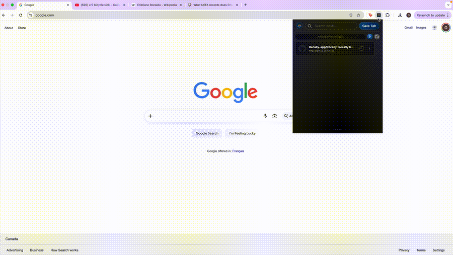

<p align="center">
  
</p>
<p align="center">Save what you read. Recall when it matters.</p>

# 🧠 Recally

Recally helps you **save and recall the articles, blogs, and docs you read online** — so you never lose track of what inspired you again.

---

## 🚀 Overview

Recally is starting as a lightweight **browser extension** that lets you:

1. **Save** the current tab (title, URL, tags)
2. **View** your list of previously saved posts
3. (Coming soon) Sync your reading list across devices

Over time, Recally will evolve into a full **web app + backend**, where you can organize, tag, and search everything you’ve read — like a personal “knowledge log” for your online reading.

---

## 🧱 Project Structure

```
recally/
│
├── extension/ # Browser extension (current focus)
│ ├── src/
│ │ ├── popup/ # Popup UI (save + view)
│ │ ├── background/ # Background scripts (listeners, sync)
│ │ ├── content/ # Optional injected scripts
│ │ ├── assets/ # Icons and images
│ │ └── styles/ # Popup CSS
│ ├── manifest.json # Extension manifest (MV3)
│ ├── package.json # Optional if bundler is added
│ └── vite.config.js # Optional if using Vite/Rollup
│
├── web/ # Future web dashboard
├── RecallySrv/ # Future backend service
└── docs/ # Architecture & design docs
```

## Technical Details
### Running the app
There isn't much to run currently lol. But coming soon

### Developing
For more details on the roadmap, see [Highlevel roadMap](https://docs.google.com/document/d/1WsfJWlSeQEt3m74yXUaScKw1gqs6-Wdkpq4fMlcyEv8/edit?tab=t.0)


### Current Stack
The technology used to develop Recally is still being decided but currently we have the below

- Web extension: TypeScript (compiled to ES2020)
- Build Tool: TypeScript compiler (tsc)
- Manifest: Chrome Manifest V3
- Storage: chrome.storage.local
- UI: HTML, CSS, and TypeScript
- Runtime: Chrome or Edge extension environment

### ⚡ Quick Start

If you just want to try out the extension quickly:

1. **Clone this repo**
   ```bash
   git clone https://github.com/Recally-app/Recally.git
   cd extension
   ```

2. **Install Node.js (version 20 or higher)**  
   See the [Install Node.js](#install-nodejs) section below 👇  
   Or download directly from the official website: [https://nodejs.org](https://nodejs.org)

3. **Install dependencies**
   ```bash
   npm install
   ```

4. **Run in development mode**
   ```bash
   npm run dev
   ```

5. **Load into Chrome**
   - Open `chrome://extensions`
   - Enable **Developer mode**
   - Click **Load unpacked**
   - Select the generated `dist` folder  
   ✅ You should now see the Recally icon appear in your toolbar!

---

### Install Node.js

Recally requires **Node.js v20 or greater** (which includes npm) to run locally.  
If you don’t have Node.js installed yet, you can install it on via the command line as described below, or alternatively visit [https://nodejs.org](https://nodejs.org) and download the **LTS (recommended)** installer for your operating system.

#### macOS
If you have [Homebrew](https://brew.sh/) installed:
```bash
brew install node
```
If you don’t have Homebrew, install it first:
```bash
/bin/bash -c "$(curl -fsSL https://raw.githubusercontent.com/Homebrew/install/HEAD/install.sh)"
```
Then run `brew install node`.

---

#### Windows (PowerShell)
Use the built-in Windows package manager:
```powershell
winget install OpenJS.NodeJS.LTS
```
Verify installation:
```powershell
node -v
npm -v
```

---

#### Linux (Ubuntu / Debian)
Run:
```bash
curl -fsSL https://deb.nodesource.com/setup_lts.x | sudo -E bash -
sudo apt-get install -y nodejs
```

---

#### ✅ Verify Installation
Run these commands to confirm Node and npm are installed:
```bash
node -v
npm -v
```
You should see Node **v20 or higher** and npm **v9 or higher**.

---

### Local Development

1. **Install Node**
[Install Node.js](#install-nodejs)
2.  **Install dependencies**
   ```bash
   cd extension
   npm install
   ```
This installs:
- vite — modern dev bundler
- @crxjs/vite-plugin — Chrome Extension support
- typescript and @types/chrome — for type safety   

2. **Run in development mode**
    ```bash
    npm run dev
    ```

Vite will start a local dev server

The plugin builds a live-reloading extension into dist/
Chrome reloads automatically whenever you save files

⚠️ You might see a one-time “bad HTTP response code (404)” — that’s harmless and part of Vite’s hot-reload setup.

3. **Load the extension in Chrome**
- Open chrome://extensions/
- Enable Developer mode
- Click Load unpacked
- Select the extension/dist/ folder
- You should now see Recally in your extensions bar!
- Click the icon to open the popup.

4. **Build a production version**
   ```bash
   npm run build
   ```
This generates an optimized, static version of the extension inside dist/.
You can zip this folder and upload it to the Chrome Web Store later.

5. **Working on the UI**

When working on the UI, be sure to checkout branding/colors.md and fonts.md for some consistent styling
## 🧹 Linting

Recally uses **ESLint** with the new [Flat Config](https://eslint.org/docs/latest/use/configure/configuration-files-new) format (`eslint.config.mts`) to maintain consistent code quality across the project.

### Running the Linter

Run ESLint on all source files:
```bash
npm run lint
```

Automatically fix simple issues:
```bash
npm run lint:fix
```

**Recommended Setup**
- Use VS Code with the official ESLint extension installed.
- Enable “Auto Fix on Save” to automatically apply lint fixes while you code.
- Run npm run lint before committing changes to ensure code consistency.
